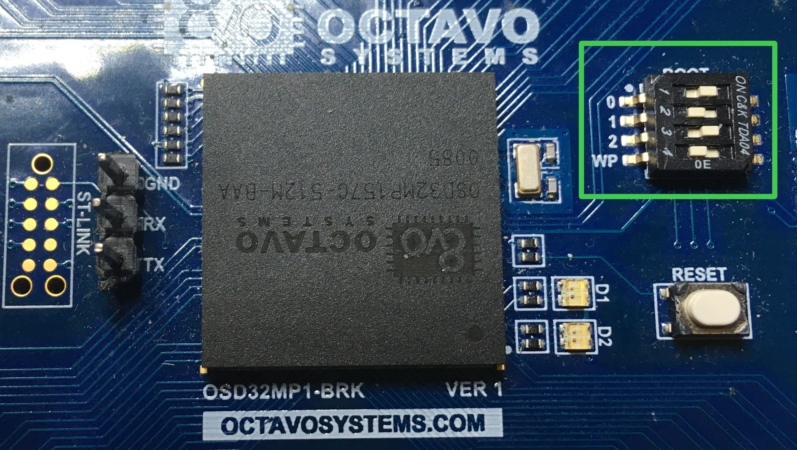

# meta-osd32mp1-brk

## Introduction

meta-meta-osd32mp1-brk is a layer providing the Octavo osd32mp1-brk board hardware support for Yocto-based OpenSTLinux system.

OCTAVO OSD32MP1-BRK <br>
<br>

 <br>

## System image

This layer should be used in order to build the st-image-weston image. It provides changes including the QT libraries.

## Building the system image

In order to build the system image a Distribution Package provided by STMicroelectronics is required. The whole building process is described on the ST wiki pages:

https://wiki.st.com/stm32mpu/wiki/STM32MP1_Distribution_Package

Before start make sure if **repo** is properly installed. If not go through following instuctions.

```shel
mkdir ~/usr
mkdir ~/usr/bin
curl https://storage.googleapis.com/git-repo-downloads/repo > ~/usr/bin/repo
sudo cp ~/usr/bin/repo /usr/bin
sudo chmod a+rx /usr/bin/repo
rm -rf ~/usr/bin/
```
Install following packages using

sudo apt-get install gawk wget diffstat unzip texinfo gcc-multilib build-essential chrpath socat libsdl1.2-dev xterm emscripten libmpc-dev libgmp3-dev dfu-util bsdmainutils libegl1-mesa libssl-dev lz4 pylint python3-git python3-jinja2 python3-pip git python-is-python3

Fill git assigment if necessary

git config --global user.email "name@email.com"
git config --global user.name "User Name"

The summary of required steps is shown below:

```shell
mkdir openstlinux-5.15-yocto-kirkstone-mp1-v22.06.15
cd openstlinux-5.15-yocto-kirkstone-mp1-v22.06.15
repo init -u https://github.com/STMicroelectronics/oe-manifest.git -b refs/tags/openstlinux-5.15-yocto-kirkstone-mp1-v22.06.15
repo sync
cd layers/meta-st
git clone -b kirkstone https://github.com/voloviq/meta-osd32mp1-brk.git
cd ../../
DISTRO=openstlinux-weston MACHINE=osd32mp1-brk source layers/meta-st/scripts/envsetup.sh
bitbake-layers add-layer ../layers/meta-st/meta-st-stm32mp-addons/
bitbake st-image-weston
```
**Note:**
Adding new layer can only be one time 
bitbake-layers add-layer ../layers/meta-st/meta-st-stm32mp-addons/

The following Octavo osd32mp1-brk machines are available:
* **osd32mp1-brk** - module with SD Card

The compiled image files are located in the directory:

```
~/openstlinux-5.15-yocto-kirkstone-mp1-v22.06.15/build-openstlinuxweston-osd32mp1-brk/tmp-glibc/deploy/images/osd32mp1-brk
```

## Installing SD card image

The SD card image needs to be created using the available script after the building process:

```
cd ~/openstlinux-5.15-yocto-kirkstone-mp1-v22.06.15/build-openstlinuxweston-osd32mp1-brk/tmp-glibc/deploy/images/osd32mp1-brk/scripts
./create_sdcard_from_flashlayout.sh ../FlashLayout_sdcard_stm32mp157c-osd32mp157c-512m-baa_minimalconfig-mx-trusted.tsv
```

The system image is located in the FlashLayout_sdcard_stm32mp157c-osd32mp157c-512m-baa_minimalconfig-mx-trusted.raw file in the ~/openstlinux-5.15-yocto-kirkstone-mp1-v22.06.15/build-openstlinuxweston-osd32mp1-brk/tmp-glibc/deploy/images/osd32mp1-brk/ directory. To install the image to a card connected to host PC the dd command may be used:

```
sudo dd if=~/openstlinux-5.15-yocto-kirkstone-mp1-v22.06.15/build-openstlinuxweston-osd32mp1-brk/tmp-glibc/deploy/images/osd32mp1-brk/FlashLayout_sdcard_stm32mp157c-osd32mp157c-512m-baa_minimalconfig-mx-trusted.raw of=/dev/sdx bs=8M conv=fdatasync status=progress
```

To boot the system from SD card on Octavo osd32mp1-brk board the BOOT jumpers must be set to 101.

 <br>

## Building the SDK

The SDK for the host system can be build by calling the bitbake command:

```shell
bitbake st-image-weston -c populate_sdk
```

The SDK installer (st-image-weston-openstlinux-weston-osd32mp1-brk-x86_64-toolchain-4.0.1-snapshot.sh) is located in the tmp-glibc/deploy/sdk directory.
